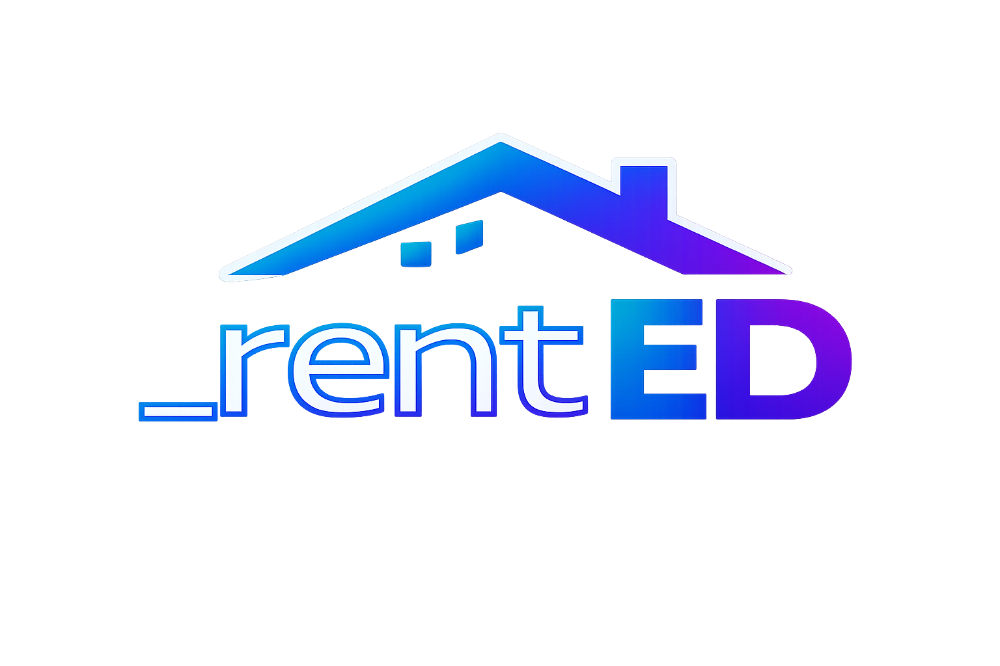

<p align="center">
  
</p>


rentED is a property management platform that combines a FastAPI backend and a Next.js dashboard
with AI-assisted rental contract ingestion. It streamlines property onboarding, captures structured
contract data, and keeps owners, documents, and event logs organized for ongoing operations.

---

## Table of Contents
1. Overview
2. Features
3. Tech Stack
4. Project Structure
5. Quick Start (Docker)
6. Environment Variables
7. Database Migrations
8. Seed Data
9. Key Workflows
10. Architecture Decisions (ADRs)
11. Dashboard Docs and Swagger
12. Testing
13. Security Notes
14. Contributing
15. License

---

## 1. Overview
rentED focuses on clean contracts, strict ownership rules, and fast onboarding:
- Properties with photos (1 to 10)
- Owner-aware access control (admin sees all, owners see only theirs)
- Contract-driven prefill via LLM suggestions
- Documents linked to properties with download access
- Domain event log with admin/user scoping
- Dashboard highlight view with OpenStreetMap + Leaflet

Suggested GitHub Topics (SaaS-standard):
`saas`, `proptech`, `fastapi`, `nextjs`, `postgres`, `redis`, `rq`, `ai`, `llm`, `openai`

---

## 2. Features
- Healthcheck: `GET /health`
- Session-based authentication (HTTP-only cookie)
- Admin-only user management
- Property CRUD with photo uploads
- Contract import suggestions (LLM) inside Create/Edit Property
- Documents linked to properties with downloads
- Activity log for core actions (login, create/update property)
- Work orders module (quote + fixed offer)
- Provider portal with expirable token links
- Alembic migrations and Docker-first setup
- Dashboard map (OpenStreetMap + Leaflet)

---

## 3. Tech Stack
- FastAPI
- SQLAlchemy
- Alembic
- PostgreSQL
- Redis + RQ
- LangChain (OpenAI)
- pypdf + optional OCR
- passlib (bcrypt)
- Leaflet + OpenStreetMap (dashboard map)
- Docker Compose
- Next.js

---

## 4. Project Structure
```
backend/
  app/
    auth.py
    db.py
    deps.py
    main.py
    models.py
    schemas.py
    ai.py
    storage.py
    static/
      docs.html
      dashboard.css
  alembic/
  scripts/
    seed.py
  tests/
  Dockerfile
  requirements.txt

frontend/
  components/
  pages/
    work-orders/
    p/wo/
  styles/
  lib/
  next.config.js
  package.json

docs/
  adr/
    0001-public-portal-by-token.md
    0002-work-order-status-model.md
    0003-proof-requires-pix-and-photo.md
    0004-token-hash-and-expiration.md
    0005-temporary-provider-identity.md
    0006-reuse-documents-storage.md
    0007-domain-event-log.md
    0008-dashboard-maps-openstreetmap.md

docker-compose.yml
.env.example
README.md
CHANGELOG.md
LICENSE
```

---

## 5. Quick Start (Docker)
### 5.1 Create env file
```
copy .env.example .env
```

### 5.2 Build and start services
```
docker compose up -d --build
```

### 5.3 Run migrations
```
docker compose run --rm api alembic upgrade head
```

### 5.4 Start worker
```
docker compose up -d worker
```

### 5.5 (Optional) Seed admin + sample data
```
docker compose run --rm api python scripts/seed.py
```

### 5.6 Open the dashboards
- API Docs: `http://localhost:8000/docs`
- Swagger: `http://localhost:8000/swagger`
- Frontend: `http://localhost:3000`

---

## 6. Environment Variables
Defined in `.env.example`:
- `POSTGRES_USER`, `POSTGRES_PASSWORD`, `POSTGRES_DB`
- `DATABASE_URL`, `REDIS_URL`
- `OPENAI_API_KEY`, `OPENAI_MODEL`, `OPENAI_TEMPERATURE`, `OPENAI_MAX_TOKENS`
- `AI_MODE` (`live` or `mock`)
- `AI_CONFIDENCE_THRESHOLD`
- `AI_LLM_INPUT_MAX_CHARS`
- `OCR_MODE` (`none` or `tesseract`)
- `SESSION_TTL_MINUTES`, `SESSION_COOKIE_NAME`, `COOKIE_SECURE`
- `SEED_ADMIN_USERNAME`, `SEED_ADMIN_PASSWORD`, `SEED_ADMIN_NAME`, `SEED_ADMIN_CELL`,
  `SEED_ADMIN_EMAIL`, `SEED_ADMIN_CPF`
- `PORTAL_TOKEN_SECRET`, `PORTAL_TOKEN_TTL_HOURS`

Optional:
- `UPLOAD_DIR` (default: `/app/data/uploads`)
- `NEXT_PUBLIC_API_BASE` (frontend)

---

## 7. Database Migrations
```
docker compose run --rm api alembic upgrade head
```

Create a new migration after model changes:
```
docker compose run --rm api alembic revision --autogenerate -m "describe_change"
```

---

## 8. Seed Data
Seed script creates one admin and sample properties.
Defaults (override in `.env`):
- Username: `admin`
- Password: `Admin123!`

Run:
```
docker compose run --rm api python scripts/seed.py
```

---

## 9. Key Workflows
### 9.1 Authentication
- `POST /auth/login`
- `GET /auth/me`
- `POST /auth/logout`

### 9.2 Create Property (LLM suggestions)
1. Fill the base property fields.
2. Upload 1 to 10 photos.
3. If rented, upload a contract and click **Suggest fields**.
4. Select fields to apply and click **Apply fields**.
5. Save the property.

The contract document is stored and linked to the property automatically.

### 9.3 Documents
- Upload: `POST /documents/upload?property_id=...`
- List: `GET /documents?property_id=...`
- Download: `GET /documents/{id}/download`

### 9.4 Event Logs
- `GET /event-logs`
- Admin sees all entries, other users see only their own.

### 9.5 Work Orders
Admin dashboard endpoints:
- `GET /work-orders`
- `POST /work-orders`
- `GET /work-orders/{id}`
- `POST /work-orders/{id}/approve-quote/{quote_id}`
- `POST /work-orders/{id}/select-interest/{interest_id}`
- `POST /work-orders/{id}/request-rework`
- `POST /work-orders/{id}/approve-proof`
- `POST /work-orders/{id}/cancel`
- `DELETE /work-orders/{id}`

Provider portal (tokenized, no session cookie):
- `GET /portal/work-orders/{token}`
- `POST /portal/work-orders/{token}/quote`
- `POST /portal/work-orders/{token}/interest`
- `POST /portal/work-orders/{token}/submit-proof`

Portal links are generated at creation (quote or fixed interest), and an execution link
is generated when a provider is selected for fixed offers.

---

## 10. Architecture Decisions (ADRs)
See `docs/adr/` for the decision records covering the provider portal, status model,
token hashing, temporary provider identity, proof requirements, event logging, and
dashboard maps.

---

## 11. Dashboard Docs and Swagger
- `/docs` provides a custom interactive dashboard.
- `/swagger` provides full OpenAPI schemas.
- `/openapi.json` returns raw OpenAPI JSON.

---

## 12. Testing
Run tests inside the container:
```
docker compose run --rm api pytest
```

---

## 13. Security Notes
- All CRUD endpoints require a session cookie.
- Admin accounts cannot be deleted via the API.
- Uploads are stored locally in `./data/uploads` (bind-mounted).
- Do not commit `.env` or API keys.
- Exposed ports are for local dev only; lock them down in production.
- Frontend dev dependency audit: Next.js has known DoS advisories. We are deferring a major upgrade
  to Next 16.x to avoid breaking changes. Track and upgrade once the frontend migration is planned.

---

## 14. Contributing
See `CONTRIBUTING.md` for the workflow and standards.

---

## 15. License
MIT. See `LICENSE` for details.
